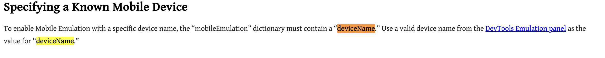
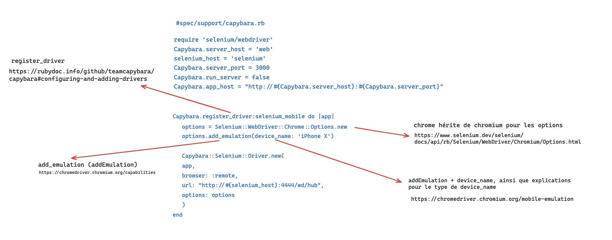
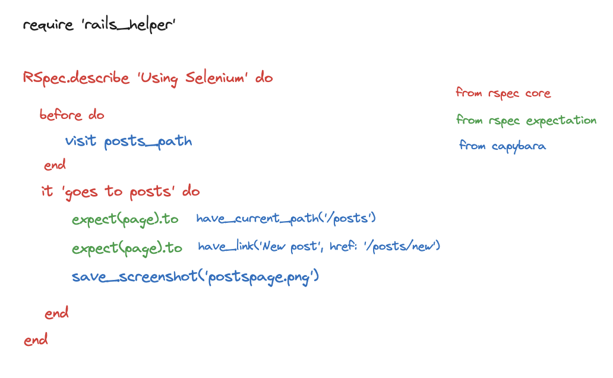

# Rails - Rspec - Capybara - Selenium

This template is setup in order to use system test in rails.

It gather, with a dockercompose, dockerfile and an entrypoint:

* container web:
  * rails 7
  * rspec
  * capybara
* container selenium
* container db
  * postgres
* container redis

## How to use it ?

1. make a folder locally, ensure you've got docker installed
2. dnwld locally the template within your folder and lauch the template
3. lets use for this example sass and webpack for assets, you can use any other

```
rails new my_project -T -d postgresql --css=sass --javascript=webpack -m rspec-capybara.rb
```

4. now you can lauch the build and up

   ```
   docker-compose build
   docker-compose up -d
   ```

Your containers are built, up and running.
As you've got the volume, you can edit your project locally and see the changes in the container.
You can go to the web container and run your tests.

## System Test Example

Here is an example of a system test setup within this template. The Capybara driver is configured to use Selenium with mobile emulation:

```ruby
# spec/system/mon_test.rb
require 'spec_helper'
require 'selenium-webdriver'
require 'rails_helper'

RSpec.describe 'Using Selenium', type: :system do
  it 'goes to posts page' do
    visit posts_path
    save_screenshot('postspage.png')
  end
end
```

### Capybara Driver Configuration

Capybara is set up with several drivers including Chrome and headless Chrome options. The configuration is defined in `spec/support/capybara.rb`. Here are the main Capybara settings:

* **Hosts and Ports** : Configured to match the Docker environment.
* **Drivers** :
  * `:chrome` for visible Chrome browser testing.
  * `:headless_chrome` for headless testing, ideal for CI environments.
  * `:selenium_mobile` uses mobile emulation for tests, using iPhone X as the device emulation model.

### Selenium/capybara webdriver Configuration

```ruby
# spec/support/capybara.rb
require 'selenium/webdriver'

Capybara.server_host = 'web'
selenium_host = 'selenium'
Capybara.server_port = 3000
Capybara.run_server = false
Capybara.app_host = "http://#{Capybara.server_host}:#{Capybara.server_port}"

Capybara.register_driver :chrome do |app|
  Capybara::Selenium::Driver.new(app, browser: :chrome)
end

Capybara.register_driver :headless_chrome do |app|
  options = Selenium::WebDriver::Chrome::Options.new
  options.add_argument '--window-size=1680,1050'
  Capybara::Selenium::Driver.new(app, browser: :remote, url: "http://#{selenium_host}:4444/wd/hub", options: options)
end

Capybara.register_driver :selenium_mobile do |app|
  options = Selenium::WebDriver::Chrome::Options.new
  options.add_emulation(device_name: 'iPhone X')
  Capybara::Selenium::Driver.new(app, browser: :remote, url: "http://#{selenium_host}:4444/wd/hub", options: options)
end

Capybara.javascript_driver = :selenium_mobile
Capybara.default_driver = :selenium_mobile
```

This configuration ensures that your system tests can simulate user interactions as closely as possible to real-world scenarios.

A noter pour le paramètrage du driver de capybara, c'est à dire le webdriver.

Note for the configuration of the capybara driver, i.e. the webdriver.

We use the chromium webdriver options (-> chrome (inherits from chromium)) from selenium.

The options syntax is available in https://www.selenium.dev/selenium/docs/api/rb/Selenium/WebDriver/Chromium/Options.html#CAPABILITIES-constant

and the available options themselves (like: add_argument, ie addArgument or add_emulation - addEmulation) are available at: https://www.selenium.dev/selenium/docs/api/rb/Selenium/WebDriver/Chromium/Options.html# CAPABILITIES-constant

and the arguments of each option are accessible as for example for add_argument (addArgument):

on the webdriver page https://chromedriver.chromium.org/mobile-emulation, which then directs to the chrome content

On utilise les options du webdriver chromium (-> chrome (hérite de chromium)) de selenium.

The options syntax is available in https://www.selenium.dev/selenium/docs/api/rb/Selenium/WebDriver/Chromium/Options.html#CAPABILITIES-constant

and the available options themselves (like: add_argument, ie addArgument or add_emulation - addEmulation) are available at: https://www.selenium.dev/selenium/docs/api/rb/Selenium/WebDriver/Chromium/Options.html# CAPABILITIES-constant

and the arguments of each option are accessible as for example for add_argument (addArgument):
(Selenium::WebDriver::Chrome::Options.new).add_argument('--window-size=1680,1050')
Or
on the webdriver page https://chromedriver.chromium.org/mobile-emulation, which then directs to the chrome content:
(Selenium::WebDriver::Chrome::Options.new).add_emulation(device_name: 'iPhone X')



The way to progress through the documentation for driver setup is:


and just as a reminder for a classic rspec system test with capybara:


